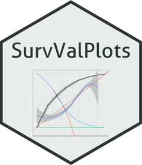

# SurvValPlots 

Tools for creating ROC, calibration, and decision curves for survival models. Jackknife pseudo-values are used to account for right-censoring. Confidence bands are provided for ROC and calibration curves.

## Installation

`SurvValPlots` can be installed from github using `devtools`.
```r
install.packages("devtools")
library(devtools)
install_github("JoshuaBridge/SurvValPlots")
```

## Example

Here is a simple example using the Rotterdam breast cancer data set in the `survival` package.
```r
library(survival) # Load the survival package
mod = coxph( # Using a Cox PH model
            Surv(rtime, recur)~ size+meno+hormon+age+nodes+pgr+er,                    
            data=rotterdam, # Using the Rotterdam data set
            x=TRUE) # Return the x matrix
```

Then the ROC, calibration, and decision curves can be displayed using the `SurvValPlots` package.
```r
library(SurvValPlots) # Load the SurvValPlots package
survPlots(mod, # The model from above
          time=365.25*3, # Predicting at 3 years
          df=rotterdam, # Using the Rotterdam data set
          eventVar = "recur", # The name of the event variable
          timeVar = "rtime", # The name of the time variable
          plotType = "All") # Which plots to display
```
